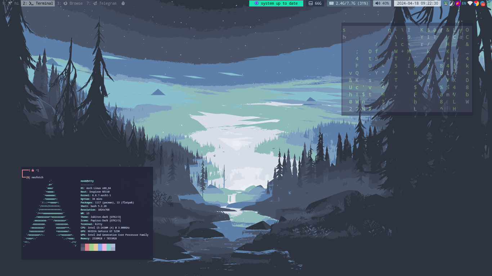
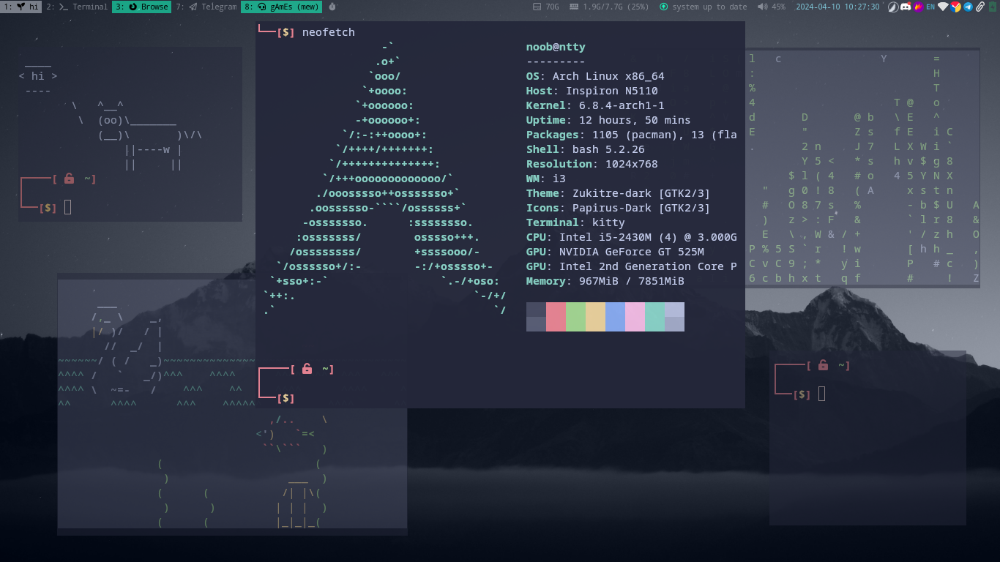
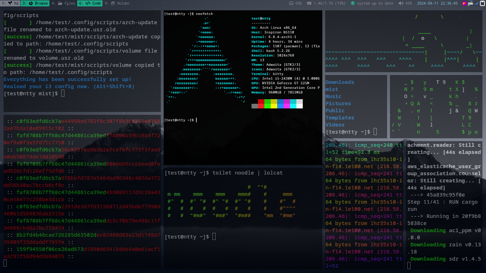
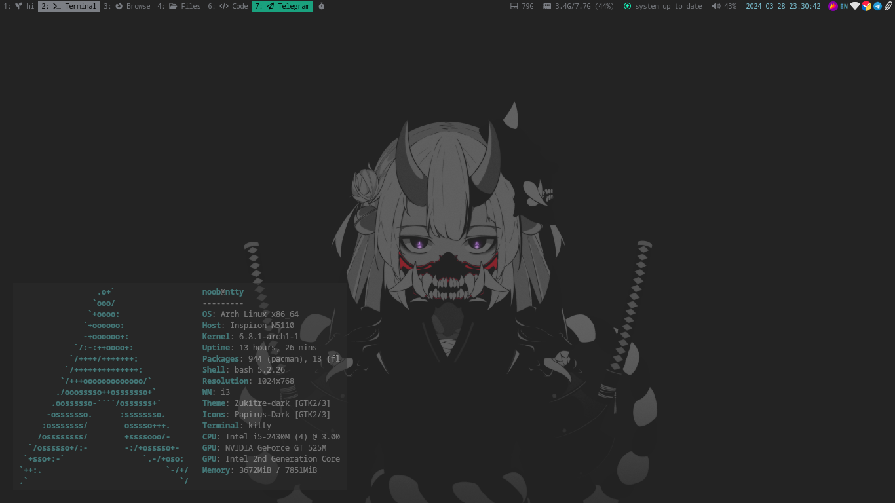

# mist
|  |
| :---: |
| latest version |




## intro  
this config was originally made for arch linux.  
you can customize this as needed, add your startup/taskbar apps in "2. apps/util/env" (see index)  
set custome colors in "1. init colors" and "7. color init"  

- table of content
  * [intro](#intro)
  * [installation](#installation)
    + [1st step. (i3 + picom)](#1st-step--i3---picom-)
    + [2nd step. (basic apps + fonts)](#2nd-step--basic-apps---fonts-)
    + [3rd step. (setup theme)](#3rd-step--setup-theme-)
  * [what you might need](#what-you-might-need)
  * [index of config](#index-of-config)


## installation
make sure you have dependencies installed:
skip those that you already have.

### 1st step. (i3 + picom)
```
sudo pacman -S i3
```
> when asked to choose for selection, select all (i3wm, i3blocks, ...)
```
sudo pacman -S picom
```

### 2nd step. (basic apps + fonts)
fonts:
```
sudo pacman -S ttf-ubuntu-font-family
```
```
sudo pacman -S ttf-droid
```
```
sudo pacman -S ttf-font-awesome
```

apps/utils:
```
sudo pacman -S feh
```
```
sudo pacman -S networkmanager network-manager-applet
```
``` 	
sudo pacman -S xfce4-clipman-plugin
```
```
sudo pacman -S flameshot
```
```
sudo pacman -S ibus
```
```
sudo pacman -S rofi
```

```
sudo pacman -S pulseaudio-alsa pulseaudio-bluetooth pulseaudio-equalizer pulseaudio-jack alsa-utils playerctl
```
needed for arch-update module:
```
sudo pacman -S pacman-contrib
```
> if you dont want to use some of these apps, you need to remove its start command manually from i3 config after step 3.  

### 3rd step. (setup theme)
```
git clone https://github.com/c404t/mist.git
```
```
cd mist
```
```
sudo chmod +x install.sh
```
```
./install.sh
```
once done, reload i3 using (Alt+Shift+R)  
you may exit i3 and login again so that startup apps would also load (Alt+Shift+E)  

## what you might need  
official user guide for better understanding: https://i3wm.org/docs/userguide.html  
i3 complete costumization tour: https://itsfoss.com/i3-customization/  
wallpapres: https://oceanofwallpapers.com/  
color palettes: https://colorhunt.co/  
font awesome icons (copy/paste): https://fontawesome.com/v5/searc  


## index of config
 ```
 index   
 ├─ 1. theme/design  
 │     ├─ mod key   
 │     ├─ font  
 │     ├─ init colors  
 │     ├─ set colors  
 │     ├─ set gaps  
 │     └─ move apps to workspaces  
 ├─ 2. apps/util/env  
 │     ├─ startup  
 │     └─ auto start   
 ├─ 3. arranging  
 │     ├─ change focus  
 │     ├─ move focused window  
 │     ├─ switch split mode  
 │     ├─ switch layout  
 │     └─ more  
 ├─ 4. workspaces   
 ├─ 5. i3 events   
 ├─ 6. resizing   
 │     ├─ window resize  
 │     └─ gaps resize  
 └─ 7. bar  
       ├─ color init  
       └─ bar section  
```
